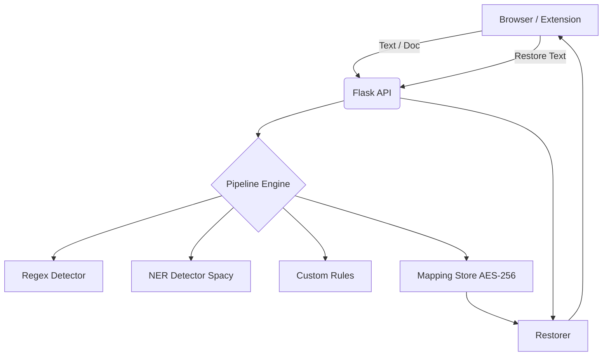

# 🛡️ Ratchet — Privacy that only tightens.

Ratchet is a local, privacy-first data shield that prevents you from accidentally leaking sensitive Personal Identifiable Information (PII) and company secrets to remote AI models like ChatGPT, Claude, or Gemini.

Ratchet sits as a local middleman between you and the AI:
1. **Redact**: You paste text or upload documents (.pdf, .docx, .xlsx) into Ratchet. It instantly scrubs out sensitive data (Names, Emails, API Keys, Credit Cards, etc.) and replaces them with secure placeholders (e.g. `[PERSON_1]`).
2. **Vault**: Ratchet saves the original data in a local, on-device vault mapping.
3. **Restore**: After you get an answer from the AI containing the placeholders, you paste the response back into Ratchet, and it instantly decodes the placeholders back into your original data!

**Zero Telemetry. 100% Local Processing. 0 Leaks.**

---

## ✨ Features

- **Text Redaction Engine**: Real-time Regex + NLP (Spacy) engine that detects patterns, API keys, and complex entities.
- **True Document Redaction**: Safely redact files (PDF, Word, Excel) locally. Plucked data is physically wiped from the files, preventing reverse-engineering.
- **Custom Rules & Exclusions**: Add your own project code-names or custom regex patterns to be detected automatically.
- **Local Telemetry Dashboard**: A beautiful, completely local dashboard tracking exactly how many items you've prevented from leaking over time.
- **Lightning Fast UI**: Built with React & Vite featuring a stunning, responsive Dark Mode interface.

---

## 🚀 Getting Started

To run Ratchet, you must start both the Backend (Python) and Frontend (React/Vite) servers.

### 1. Backend Setup (Python)
Ensure you have Python 3.9+ installed.

```bash
cd backend
python -m venv venv

# Activate the virtual environment
# On Windows:
.\venv\Scripts\activate
# On Mac/Linux:
source venv/bin/activate

# Install requirements
pip install -r requirements.txt
python -m spacy download en_core_web_sm

# Start the Flask server
python app.py
```
*(The backend runs on `http://127.0.0.1:5000` by default)*

### 2. Frontend Setup (React/Node)
Ensure you have Node.js 18+ installed.

```bash
cd frontend
npm install

# Start the Vite dev server
npm run dev
```
*(The frontend will run on `http://localhost:5173`)*

---

## 📖 How to Use

Check the `Context/manual_guide.md` for a comprehensive step-by-step user manual, including end-to-end stress test data you can try out!

## 🛠️ Architecture



- **Backend**: Python, Flask, Spacy (NER), PyMuPDF (PDF handler), OpenPyXL (Excel handler), Python-docx (Word handler).
- **Frontend**: React, TypeScript, Vite, Lucide React (Icons).
- **Storage**: In-memory Python mappings for active sessions, synchronized via browser `localStorage`.

---

## 📡 API Reference

### `POST /api/detect`
Detects sensitive entities in text.
- **Body**: `{"text": "My email is test@example.com"}`
- **Response**: List of detected entities with confidence scores.

### `POST /api/redact`
Redacts text and securely stores the mapping.
- **Body**: `{"text": "My email is test@example.com", "session_id": "optional-uuid"}`
- **Response**: `{"redacted_text": "My email is [EMAIL_0]", "session_id": "...", "entities": [...]}`

### `POST /api/restore`
Restores original text from placeholders using the session mapping.
- **Body**: `{"text": "Here is the response for [EMAIL_0]", "session_id": "..."}`
- **Response**: `{"restored_text": "Here is the response for test@example.com"}`

### `POST /api/document/redact`
Redacts a supported document file (.pdf, .docx, .xlsx, .pptx, .csv, .txt).
- **Body**: `multipart/form-data` with `file` and optional `session_id`.
- **Response**: Downloadable redacted file.

### `GET /api/rules` | `POST /api/rules`
Manage custom rules.
- **POST Body**: `{"action": "add", "rule": {...}}` or `{"action": "delete", "rule_name": "..."}`

### `GET /api/sessions` | `DELETE /api/sessions/<id>`
Manage active memory sessions.
