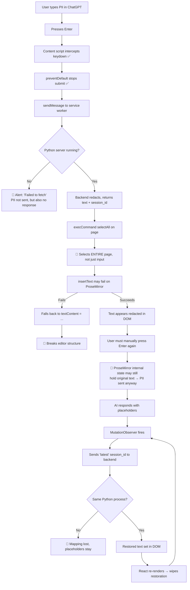

# 🔍 Ratchet Extension — Diagnosis Report

> **Verdict: The extension is fundamentally broken in multiple overlapping ways.**
> At least 5 of the 8 diagnostic areas have confirmed showstoppers. The extension cannot successfully redact-send-restore on any live AI site in its current state.

---

## Root Cause Ranking (by impact)

| Rank | Issue | Severity | Status |
|------|-------|----------|--------|
| **#1** | Popup & Options HTML reference scripts at `/assets/...` (absolute root paths) — 404s in extension context | 🔴 CRITICAL | **Confirmed** |
| **#2** | Python backend must be running on `localhost:5000` — single point of failure, no fallback, no auto-start | 🔴 CRITICAL | **Confirmed** |
| **#3** | DOM interception sets `.value`/`innerText`/`execCommand` on React/ProseMirror inputs — does NOT update site internal state; original PII still gets sent | 🔴 CRITICAL | **Confirmed** |
| **#4** | Content script runs in ISOLATED world but needs MAIN world to wrap `fetch`/`XHR` — cannot intercept at network layer | 🔴 CRITICAL | **Confirmed** |
| **#5** | MutationObserver on `document.body` fires on *every* DOM change — sends a `fetch` to Python for each text node — infinite loop + massive performance hit | 🟠 HIGH | **Confirmed** |
| **#6** | Mapping is "latest session" only, no per-conversation keying, no persistence across service worker restart | 🟠 HIGH | **Confirmed** |
| **#7** | `selectAll` + `insertText` selects the entire page, not just the input field | 🟠 HIGH | **Confirmed** |
| **#8** | Hardcoded selectors will break on any site DOM update | 🟡 MEDIUM | **Suspected** |
| **#9** | Placeholder `[TYPE_N]` is mangled by markdown rendering | 🟡 MEDIUM | **Suspected** |
| **#10** | React 142KB `client.js` chunk loaded as `modulepreload` in popup — bloated and may cause CSP issues | 🟡 MEDIUM | **Confirmed** |

---

## Detailed Findings

### 1. Build & Manifest

**Status: 🔴 CRITICAL — broken popup and options pages**

The build succeeds (`tsc && vite build` exits 0), producing:

```
dist/
├── manifest.json                    # Copied from public/ verbatim
├── src/popup/popup.html             # Vite-processed
├── src/options/options.html         # Vite-processed
└── assets/
    ├── background.js    (708 B)     # Service worker
    ├── content.js       (4 KB)      # Content script
    ├── popup.js         (2.5 KB)    # Popup entry
    ├── options.js       (2.6 KB)    # Options entry
    ├── client.js        (142 KB)    # React runtime (shared chunk)
    └── options.css      (1.6 KB)
```

**Problem A — Absolute paths in HTML:**
The built [popup.html](file:///c:/Users/USER/OneDrive/Documents/Ratchet/extension/dist/src/popup/popup.html#L21-L22) contains:
```html
<script type="module" crossorigin src="/assets/popup.js"></script>
<link rel="modulepreload" crossorigin href="/assets/client.js">
```

The `/assets/...` root-relative paths **resolve to nothing** in an extension context (there is no web server root). Chrome extensions need relative paths like `../../assets/popup.js` or the `chrome-extension://` scheme. This means the **popup and options pages render a blank white `<div id="root">` with zero JavaScript**.

**Problem B — Manifest structure:**
The [manifest.json](file:///c:/Users/USER/OneDrive/Documents/Ratchet/extension/public/manifest.json) references:
- `"default_popup": "src/popup/popup.html"` → resolves to `dist/src/popup/popup.html` ✅ (file exists)
- `"service_worker": "assets/background.js"` → resolves to `dist/assets/background.js` ✅
- `"js": ["assets/content.js"]` → resolves to `dist/assets/content.js` ✅
- But popup.html's internal script references are broken (Problem A above)

**Problem C — No `outDir` base configuration:**
[vite.config.ts](file:///c:/Users/USER/OneDrive/Documents/Ratchet/extension/vite.config.ts) lacks `base: './'` or `base: ''`, so Vite defaults to `base: '/'`, producing root-absolute paths in HTML.

**Problem D — `content_scripts` and `background` lack `"type": "module"`:**
The manifest declares `"service_worker": "assets/background.js"` without `"type": "module"`. The built background.js does not use ES module syntax (it's IIFE-minified), so this works. But `popup.js` and `options.js` use `type="module"` in their HTML `<script>` tags, which requires CSP `'wasm-unsafe-eval'` on some Chrome versions and can conflict with the default MV3 CSP.

**Problem E — Permissions:**
- `"activeTab"` is present but never actually used (no `chrome.tabs` API calls in the content script)
- `"scripting"` is present but never used either
- Missing: No `"offscreen"` permission if planning to use offscreen documents
- `host_permissions` correctly includes the three AI sites and localhost

---

### 2. Core Bridge (Extension ↔ Python Backend)

**Status: 🔴 CRITICAL — every redact/restore call fails if Python server is down**

**Architecture:** The extension uses a localhost HTTP bridge:
- Content script sends `chrome.runtime.sendMessage({action: 'redact', text})` → service worker
- Service worker fetches `http://127.0.0.1:5000/api/redact` → Python Flask backend
- No native messaging, no WASM, no fallback

**Evidence in [service-worker.ts](file:///c:/Users/USER/OneDrive/Documents/Ratchet/extension/src/background/service-worker.ts#L8-L15):**
```typescript
fetch('http://127.0.0.1:5000/api/redact', {
  method: 'POST',
  headers: { 'Content-Type': 'application/json' },
  body: JSON.stringify({ text: request.text })
})
```

**Failure modes:**
1. **User hasn't started the Python server** → `fetch` throws `ERR_CONNECTION_REFUSED` → user gets alert "Ratchet Error: TypeError: Failed to fetch" on every prompt
2. **No auto-start mechanism** — there's no native messaging host manifest, no startup script, no health check
3. **CORS** — The Flask backend uses `CORS(app)` ([app.py:6](file:///c:/Users/USER/OneDrive/Documents/Ratchet/backend/app.py#L6)) which allows all origins, and the service worker has `host_permissions` for localhost, so CORS itself is not the problem. However...
4. **MV3 service worker `fetch` restriction** — In MV3, `fetch` from a service worker to `http://` (non-HTTPS) requires the `host_permissions` to include the URL. This is present (`"http://127.0.0.1:5000/*"`), so the fetch *should* work when the server is running.
5. **No session_id passed on redact** — [service-worker.ts:11](file:///c:/Users/USER/OneDrive/Documents/Ratchet/extension/src/background/service-worker.ts#L11) sends only `{text}`, no `session_id`. The backend creates a new session each time ([engine.py:67-68](file:///c:/Users/USER/OneDrive/Documents/Ratchet/backend/core/engine.py#L67-L68)). The response includes `session_id` but the content script **never saves it or sends it back for restore**.

**Also:** The popup makes direct `fetch` calls to `http://127.0.0.1:5000` from the popup context ([popup/index.tsx:18](file:///c:/Users/USER/OneDrive/Documents/Ratchet/extension/src/popup/index.tsx#L18)), bypassing the service worker entirely. This would fail under MV3 CSP depending on Chrome version.

---

### 3. Service Worker Lifecycle

**Status: 🟠 HIGH — mapping data is lost across worker restarts**

The service worker ([service-worker.ts](file:///c:/Users/USER/OneDrive/Documents/Ratchet/extension/src/background/service-worker.ts)) is stateless — it holds no mapping data itself. **All** mapping state lives in the Python backend's in-memory `MappingStore` ([mapping_store.py](file:///c:/Users/USER/OneDrive/Documents/Ratchet/backend/core/mapping_store.py)).

This means:
- **If the Python server restarts, ALL mappings are lost** — `self.sessions = {}` in `__init__`
- The service worker itself can be killed after ~30s idle (MV3 spec), but since it holds no state, that's not the direct problem — the problem is that nothing reconnects or validates the session
- The content script's `ContentRestorer` always sends `session_id: 'latest'` ([restorer.ts:52](file:///c:/Users/USER/OneDrive/Documents/Ratchet/extension/src/content/restorer.ts#L52)), so if the backend has restarted, `get_mapping('latest')` returns `{}` and nothing gets restored

**The mapping is also not encrypted at rest** — `MappingStore` encrypts values in memory using Fernet, but never persists to disk. If you close the Python process, everything is gone.

---

### 4. Prompt Interception

**Status: 🔴 CRITICAL — redacted text does NOT reach the AI model**

This is the most important failure. The content script intercepts the prompt and replaces text in the DOM, but on modern AI sites this doesn't actually change what gets sent.

#### 4a. Enter key interception ([interceptor.ts:43-56](file:///c:/Users/USER/OneDrive/Documents/Ratchet/extension/src/content/interceptor.ts#L43-L56))

```typescript
document.addEventListener('keydown', (e) => {
  if (e.key === 'Enter' && !e.shiftKey) {
    e.preventDefault();
    e.stopPropagation();
    this.handleIntercept();
  }
}, { capture: true });
```

- Uses `capture: true` ✅ — correctly intercepts before the site's listener
- Calls `preventDefault()` ✅ — stops the site from submitting
- **But**: after replacing text, it **never re-triggers the submit**. The comment at [line 136](file:///c:/Users/USER/OneDrive/Documents/Ratchet/extension/src/content/interceptor.ts#L136) says "we leave it to the user", but the user already pressed Enter and it was eaten. The user has to press Enter **again** after redaction completes (which is async!). This is a race condition.

#### 4b. Send button interception ([interceptor.ts:59-78](file:///c:/Users/USER/OneDrive/Documents/Ratchet/extension/src/content/interceptor.ts#L59-L78))

```typescript
const sendButton = target.closest('button[aria-label*="Send"], button[data-testid*="send"], button[aria-label*="message"]');
```

- Selector fragility aside, this intercepts the click and prevents it
- Same problem: replaces text but **never re-clicks the button**

#### 4c. Text replacement on React-controlled textarea ([interceptor.ts:98-109](file:///c:/Users/USER/OneDrive/Documents/Ratchet/extension/src/content/interceptor.ts#L98-L109))

```typescript
const nativeInputValueSetter = Object.getOwnPropertyDescriptor(
  window.HTMLTextAreaElement.prototype, 'value')?.set;
nativeInputValueSetter.call(this.inputElement, data.redacted_text);
this.inputElement.dispatchEvent(new Event('input', { bubbles: true }));
```

- Uses the native setter trick ✅ — this is the correct approach for React `<textarea>`
- Dispatches `input` event ✅
- **BUT**: this runs in the **ISOLATED** content script world. `Object.getOwnPropertyDescriptor(window.HTMLTextAreaElement.prototype, 'value')` accesses the **content script's** `window`, not the page's. If React has monkey-patched or the site uses a synthetic event system, the `input` event might not propagate correctly.
- **ChatGPT** uses a `contenteditable` ProseMirror editor, not a `<textarea>`, so this branch is never hit on ChatGPT.

#### 4d. Text replacement on contenteditable (ProseMirror/Lexical) ([interceptor.ts:111-131](file:///c:/Users/USER/OneDrive/Documents/Ratchet/extension/src/content/interceptor.ts#L111-L131))

```typescript
document.execCommand('selectAll', false, undefined);
const success = document.execCommand('insertText', false, data.redacted_text);
```

**🔴 CRITICAL BUG**: `document.execCommand('selectAll')` selects **ALL text on the entire page**, not just the contenteditable element's content. On ChatGPT, this would select the entire conversation history, then `insertText` would attempt to replace it all with the redacted text.

Even if `selectAll` was scoped correctly (e.g., by focusing the element first — which the code does at [line 112](file:///c:/Users/USER/OneDrive/Documents/Ratchet/extension/src/content/interceptor.ts#L112)), `execCommand` is deprecated and unreliable in ProseMirror editors. ProseMirror maintains its own internal document model; modifying the DOM directly causes it to either:
- Reject the change on the next re-render (state mismatch)
- Throw an error and revert

The fallback at [lines 122-131](file:///c:/Users/USER/OneDrive/Documents/Ratchet/extension/src/content/interceptor.ts#L122-L131) sets `textContent` directly, which **destroys the ProseMirror DOM structure** and breaks the editor.

**Bottom line: On ChatGPT (ProseMirror), Claude (Lexical/contenteditable), and Gemini, the redacted text either doesn't persist in the editor's state or corrupts the editor.**

---

### 5. Content Script World

**Status: 🔴 CRITICAL — wrong world for network interception**

The [manifest.json](file:///c:/Users/USER/OneDrive/Documents/Ratchet/extension/public/manifest.json#L29-L38) declares:
```json
"content_scripts": [{
  "matches": [...],
  "js": ["assets/content.js"],
  "run_at": "document_end"
}]
```

No `"world": "MAIN"` is specified, so it defaults to **ISOLATED world**.

**Implications:**
- The content script **cannot** wrap `window.fetch` or `XMLHttpRequest` to intercept at the network layer. These are different `window` objects in isolated vs main world.
- The `Object.getOwnPropertyDescriptor(window.HTMLTextAreaElement.prototype, 'value')` call in [interceptor.ts:100](file:///c:/Users/USER/OneDrive/Documents/Ratchet/extension/src/content/interceptor.ts#L100) accesses the ISOLATED world's prototype, which may work for DOM manipulation but doesn't help with React's internal fiber state.
- DOM manipulation (querySelector, addEventListener) works across worlds ✅
- `chrome.runtime.sendMessage` is only available in ISOLATED world ✅ — if you move to MAIN world, you lose messaging

The extension attempts DOM-level interception only and has no network-layer strategy at all.

---

### 6. Response Restoration

**Status: 🟠 HIGH — infinite loop, split placeholders, stale restoration**

#### 6a. MutationObserver scope ([restorer.ts:11-15](file:///c:/Users/USER/OneDrive/Documents/Ratchet/extension/src/content/restorer.ts#L11-L15))

```typescript
this.observer.observe(document.body, {
  childList: true,
  subtree: true,
  characterData: true
});
```

This observes **every single DOM change** on the entire page — not just the response area. Every character typed, every UI animation, every tooltip creates a mutation. For each mutation:

1. TreeWalker scans the subtree for text nodes matching `/\[[A-Z_]+\_\d+\]/`
2. For each match, sends `chrome.runtime.sendMessage` → service worker → `fetch` to Python
3. Python decrypts and returns the restored text
4. The restored text is set via `node.nodeValue = data.restored_text`
5. Setting `nodeValue` triggers a **new mutation** → **infinite loop** (until the text no longer contains placeholders)

The guard at [restorer.ts:55](file:///c:/Users/USER/OneDrive/Documents/Ratchet/extension/src/content/restorer.ts#L55) (`data.restored_text !== node.nodeValue`) would stop the loop *after* restoration, but only if the Python backend successfully restores. If it returns the same text (e.g., no mapping found), it won't loop — but it will still fire a network request for every mutation.

#### 6b. Streaming responses and split placeholders

AI sites stream responses token-by-token. A placeholder like `[PERSON_1]` may arrive as:
- Text node 1: `[PERSON`
- Text node 2: `_1]`

The regex `/\[[A-Z_]+\_\d+\]/` would **not match** either fragment, so the placeholder would never be restored until the site re-renders the complete text in a single node (which may or may not happen).

#### 6c. Markdown rendering

AI responses are rendered as markdown → HTML. The placeholder `[PERSON_1]` in markdown could become:
- A link: `<a href="PERSON_1">PERSON_1</a>` (markdown link syntax `[text](url)`)
- Escaped: `\[PERSON_1\]`
- In a code block: `<code>[PERSON_1]</code>`

Any of these would break the regex match or produce incorrect output.

#### 6d. React re-renders wipe restored text

When the AI site's React tree re-renders (common during streaming), it replaces DOM nodes wholesale. Any `nodeValue` changes made by the restorer are lost and must be re-applied.

---

### 7. Mapping Scope

**Status: 🟠 HIGH — effectively broken for multi-turn conversations**

- The content script **never persists** the `session_id` returned by the `/api/redact` call. The redact response includes `session_id` but it's only used to display entities in the popup.
- The restore call always sends `session_id: 'latest'` ([restorer.ts:52](file:///c:/Users/USER/OneDrive/Documents/Ratchet/extension/src/content/restorer.ts#L52))
- If the user sends two messages with different PII, the second call creates a new session. `'latest'` only returns the most recent session, so **mappings from the first message are lost for restoration**.
- The backend merges mappings within a session ([mapping_store.py:29-31](file:///c:/Users/USER/OneDrive/Documents/Ratchet/backend/core/mapping_store.py#L29-L31)), but since no `session_id` is passed during redaction, every redact creates a new session.
- There is **no per-conversation** keying — no way to associate a ChatGPT conversation with a Ratchet session.

---

### 8. Selector Fragility

**Status: 🟡 MEDIUM — suspected, cannot verify without live site testing**

Hardcoded selectors in [interceptor.ts](file:///c:/Users/USER/OneDrive/Documents/Ratchet/extension/src/content/interceptor.ts):

| Selector | Used for | Fragility |
|----------|----------|-----------|
| `#prompt-textarea` (line 29) | ChatGPT input | 🟡 ChatGPT has used this ID historically, but it's not guaranteed |
| `textarea, [contenteditable="true"]` (line 28, 66) | Generic fallback | 🟢 Reasonably stable |
| `button[aria-label*="Send"]` (line 62) | Send button detection | 🟡 Depends on site's localization and version |
| `button[data-testid*="send"]` (line 62) | Send button | 🟡 `data-testid` often removed in production builds |
| `button[aria-label*="message"]` (line 62) | Claude's send button | 🟡 Vague, may match wrong buttons |

The restorer has **no site-specific selectors** — it observes `document.body` globally, which is worse (performance) but less fragile.

---

## Additional Issues Found

### A. Popup makes direct fetch calls bypassing service worker
[popup/index.tsx:18-21](file:///c:/Users/USER/OneDrive/Documents/Ratchet/extension/src/popup/index.tsx#L18-L21) calls `fetch('http://127.0.0.1:5000/api/restore')` directly from the popup. In MV3, popup pages have their own CSP. This fetch may be blocked depending on the Chrome version and CSP configuration.

### B. Options page `useEffect` dependency on `apiEndpoint`
[Options.tsx:22](file:///c:/Users/USER/OneDrive/Documents/Ratchet/extension/src/options/Options.tsx#L22) has `apiEndpoint` in the dependency array but uses the stale initial value `http://127.0.0.1:5000` on first render, before `chrome.storage.local.get` returns. This creates a race condition and a wasted fetch.

### C. "Open Full Dashboard" button opens localhost:5173
[popup/index.tsx:85](file:///c:/Users/USER/OneDrive/Documents/Ratchet/extension/src/popup/index.tsx#L85) opens `http://localhost:5173` — the Vite dev server for the separate frontend app. This won't work in production.

### D. Popup stats are hardcoded
[popup/index.tsx:11](file:///c:/Users/USER/OneDrive/Documents/Ratchet/extension/src/popup/index.tsx#L11): `setStats({ detected: 14, redacted: 12 })` — always shows 14/12 regardless of actual activity.

### E. Backend `app.py` imports from `packages/core/documents/router`
[app.py:73-74](file:///c:/Users/USER/OneDrive/Documents/Ratchet/backend/app.py#L73-L74):
```python
sys.path.append(os.path.join(os.path.dirname(os.path.abspath(__file__)), '..', 'packages'))
from core.documents.router import DocumentRouter
```
But `packages/core/documents/` only has a `documents` directory — the import would fail at startup if the route is ever hit.

---

## What I Could NOT Verify (Requires Live Browser)

1. **Actually loading the extension unpacked in Chrome** — I cannot open Chrome from this environment. The build succeeds and the file structure looks correct for loading, but I cannot confirm service worker registration or content script injection.
2. **Live site DOM matching** — I cannot navigate to chatgpt.com, claude.ai, or gemini.google.com to verify that the selectors find the correct elements on the current version of each site.
3. **Service worker idle timeout behavior** — Requires a real Chrome instance running for >30 seconds idle.
4. **Actual CORS/CSP errors** — Need Chrome DevTools console to see if MV3 blocks the localhost fetch.

---

## Summary: What happens when a user tries to use Ratchet today



> [!CAUTION]
> **In practice, Ratchet does NOT protect the user's PII.** The DOM-level text replacement does not reliably update the internal state of React/ProseMirror/Lexical editors. Even when the DOM shows redacted text, the original text is likely still sent to the AI service via the site's own `fetch`/`XHR` calls, which the extension cannot intercept from the ISOLATED world.
