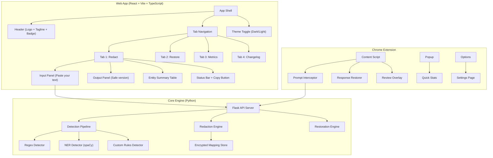

# 🛡️ Ratchet — 6-Day Full Production Build Plan

> **Goal**: A complete, production-grade privacy shield web app + Chrome extension — with the exact UI from the reference designs.

---

## 🎨 Frontend Design Analysis

Based on the reference images, here's the exact UI specification:

### Logo & Branding
- **Logo**: Black samurai warrior silhouette with katana — used as the app icon
- **App Name**: "Ratchet" in bold serif/display font
- **Tagline**: "Privacy that only tightens" in muted grey
- **Badge**: "Runs on this device" pill button (top-right) with a processing/shield icon

### Layout Structure
```
┌──────────────────────────────────────────────────────────────┐
│  [Logo] Ratchet  "Privacy that only tightens"   [Runs on..] │
├──────────────────────────────────────────────────────────────┤
│  ① Redact  |  ② Restore  |  ③ Metrics  |  ④ Changelog      │
├────────────────────────────┬─────────────────────────────────┤
│  📋 Paste your text        │  ✅ Safe version to send        │
│                            │                                 │
│  Hi, my name is [M.Nafees] │  Hi, my name is [PERSON_1]     │
│  reach me at [email]       │  reach me at [EMAIL_1]          │
│  CNIC is [42201-...]       │  CNIC is [CNIC_1]              │
│  API key [sk-7f3a...]      │  API key [API_KEY_1]           │
├────────────────────────────┴─────────────────────────────────┤
│  🛡️ 5 items found, all hidden              [Copy safe text] │
├──────────────────────────────────────────────────────────────┤
│  ☑ TYPE     │ ORIGINAL VALUE     │ → │ PLACEHOLDER │ CONF.  │
│  ☑ Name     │ M.Nafees           │ → │ PERSON_1    │ 98%    │
│  ☑ Email    │ nafees@example.com │ → │ EMAIL_1     │ 99%    │
│  ☑ CNIC     │ 42201-1234567-1   │ → │ CNIC_1      │ 97%    │
│  ☑ API key  │ sk-7f3a9e8c4d...  │ → │ API_KEY_1   │ 96%    │
└──────────────────────────────────────────────────────────────┘
```

### Color System (Extracted from Designs)

| Element | Dark Mode | Light Mode |
|---|---|---|
| **Background** | `#1a1a2e` (deep navy-black) | `#ffffff` (white) |
| **Surface/Cards** | `#16213e` (dark blue-grey) | `#f8f9fa` (light grey) |
| **Card Borders** | `#2a2a4a` (subtle purple-grey) | `#e2e8f0` (light border) |
| **Text Primary** | `#e2e8f0` (off-white) | `#1a202c` (near-black) |
| **Text Secondary** | `#94a3b8` (muted grey) | `#64748b` (grey) |
| **Accent / Active Tab** | `#e53e3e` (red) | `#e53e3e` (red) |
| **Name badge** | `#805ad5` (purple) | `#805ad5` (purple) |
| **Email badge** | `#3182ce` (blue) | `#3182ce` (blue) |
| **CNIC badge** | `#dd6b20` (orange) | `#dd6b20` (orange) |
| **API Key badge** | `#e53e3e` (red) | `#e53e3e` (red) |
| **Placeholder badge** | `#2d3748` bg + colored text | `#edf2f7` bg + colored text |
| **Checkboxes** | Red filled `#e53e3e` | Red filled `#e53e3e` |
| **Copy button** | Red pill `#e53e3e` white text | Red pill `#e53e3e` white text |
| **"Runs on device" badge** | Red outline, red text | Red outline, red text |

### Entity Type Color Mapping

| Entity Type | Badge Color | Icon |
|---|---|---|
| **Name / Person** | Purple `#805ad5` | 👤 Person icon |
| **Email** | Blue `#3182ce` | ✉️ Mail icon |
| **CNIC / ID** | Orange `#dd6b20` | 🪪 ID card icon |
| **API Key** | Red `#e53e3e` | 🔑 Key icon |
| **Phone** | Green `#38a169` | 📞 Phone icon |
| **Credit Card** | Pink `#d53f8c` | 💳 Card icon |
| **Address** | Teal `#319795` | 📍 Location icon |
| **SSN** | Amber `#d69e2e` | 🔒 Lock icon |

### Typography
- **App title**: Bold, ~28px, serif or display weight
- **Tagline**: Regular, ~14px, muted color
- **Tab labels**: Medium, ~15px
- **Section headings**: Semi-bold, ~18px, with icon prefix
- **Body text in panels**: Regular, ~14px, monospace for values
- **Table headers**: Uppercase, ~12px, letter-spacing, muted
- **Badges/pills**: Bold, ~12px, rounded-full, padding 4px 12px
- **Confidence**: Regular, ~14px

### Key UI Components
1. **Inline entity highlights** — colored pill badges embedded within flowing text
2. **Side-by-side panels** — "Paste your text" (left) / "Safe version to send" (right)
3. **Entity summary table** — checkbox, icon, type badge, original value, arrow, placeholder badge, confidence %
4. **Status bar** — "X items found, all hidden" with shield icon
5. **Copy safe text button** — red pill, top-right of status bar
6. **Tab navigation** — numbered circles (①②③④) with red underline on active
7. **Dark/Light mode toggle** — theme switcher

---

## 📐 Full Project Architecture



---

## 📅 Day 1 (Oct 4) — Complete Core Backend Engine

> **12–14 hours | All detection, redaction, restoration, encrypted storage, API**

### Morning (4h) — Detection Pipeline

- [ ] **Repo & project setup** — monorepo structure:
  ```
  ratchet/
  ├── backend/
  │   ├── detectors/
  │   │   ├── __init__.py
  │   │   ├── regex_detector.py
  │   │   ├── ner_detector.py
  │   │   └── custom_rules.py
  │   ├── core/
  │   │   ├── engine.py
  │   │   ├── redactor.py
  │   │   ├── restorer.py
  │   │   ├── mapping_store.py
  │   │   └── models.py
  │   ├── config/
  │   │   ├── default_rules.json
  │   │   └── settings.py
  │   ├── app.py
  │   ├── requirements.txt
  │   └── tests/
  ├── frontend/              # React + Vite app
  ├── extension/             # Chrome extension
  ├── Context/               # Design reference images + logo
  └── README.md
  ```
- [ ] **`regex_detector.py`** — Full pattern library:
  - Emails, phone numbers (international), credit cards (Luhn), SSNs
  - CNIC numbers (Pakistani national ID: `XXXXX-XXXXXXX-X`)
  - IPv4, IPv6, MAC addresses
  - API keys (AWS `AKIA...`, GitHub `ghp_...`, Slack `xoxb-...`, generic `sk-...`)
  - URLs with credentials, dates of birth
  - Each returns: `type`, `value`, `start`, `end`, `confidence`
- [ ] **`ner_detector.py`** — spaCy `en_core_web_sm`:
  - PERSON, ORG, GPE, LOC, DATE, MONEY, NORP
  - Confidence threshold from config
- [ ] **`custom_rules.py`** — keyword, regex, glob rules from JSON config

### Afternoon (4h) — Redaction, Restoration, Storage

- [ ] **`engine.py`** — Pipeline: run all detectors → merge → deduplicate → score
- [ ] **`redactor.py`** — Placeholder generation (`[PERSON_1]`, `[EMAIL_1]`, etc.), consistent numbering, utility preservation
- [ ] **`mapping_store.py`** — AES-256 encrypted session store with auto-expiry
- [ ] **`restorer.py`** — Exact + fuzzy matching, handles AI-modified placeholders

### Evening (4h) — API Server & Testing

- [ ] **`app.py`** — Flask API:
  ```
  POST /api/detect    → entities only
  POST /api/redact    → redacted text + entities + session
  POST /api/restore   → restored text
  POST /api/rules     → CRUD custom rules
  GET  /api/sessions  → list sessions
  GET  /api/health    → status
  ```
- [ ] 30+ test cases covering all detectors + round-trip
- [ ] Verify via curl

#### ✅ Day 1 Done When
Full redact → restore round-trip works via API with encrypted storage.

---

## 📅 Day 2 (Oct 5) — Frontend Web App (Redact Tab + Theme System)

> **12–14 hours | The main web app UI matching the reference designs exactly**

### Morning (4h) — Project Setup & Design System

- [ ] **Initialize React + Vite + TypeScript** project in `frontend/`
- [ ] **Design system / CSS variables** — full dark + light mode tokens matching the color palette above
- [ ] **Theme toggle** — dark/light mode with `prefers-color-scheme` detection
- [ ] **Google Fonts**: Inter (body) + display font for title
- [ ] **Component library setup**:
  - `Badge` — colored pill (Name=purple, Email=blue, etc.)
  - `EntityHighlight` — inline highlighted text within flowing paragraph
  - `IconButton`, `PillButton`
  - `Card` — surface container with border

### Afternoon (5h) — Redact Tab (Main Screen)

- [ ] **Header component**:
  - Samurai logo (from `Context/logo.jfif`) left-aligned
  - "Ratchet" title + "Privacy that only tightens" tagline
  - "Runs on this device" badge pill (top-right, red outline)
  - Dark/light mode toggle button
- [ ] **Tab navigation**:
  - 4 tabs: ① Redact | ② Restore | ③ Metrics | ④ Changelog
  - Numbered red circles, red underline on active tab
- [ ] **"Paste your text" panel** (left):
  - Editable textarea/contenteditable
  - Real-time entity detection as user types (debounced 300ms)
  - Detected entities shown as **inline colored badges** within the text
  - Color matches entity type (purple for names, blue for emails, etc.)
- [ ] **"Safe version to send" panel** (right):
  - Read-only mirror of input with placeholders replacing entities
  - Placeholders shown as **dark badges** with entity label (`PERSON_1`, `EMAIL_1`)
  - Updates in real-time as left panel changes
- [ ] **Side-by-side layout** — responsive, equal width panels

### Evening (3h) — Entity Summary Table + Status Bar

- [ ] **Status bar**:
  - Shield icon + "**X items** found, all hidden" text
  - "Copy safe text" red pill button (copies redacted text to clipboard)
- [ ] **Entity table**:
  - Columns: Checkbox | Icon | Type (colored badge) | Original Value | → arrow | Placeholder (badge) | Confidence %
  - Each row has a red checkbox (toggle redaction on/off per entity)
  - Unchecking = whitelisting that entity (un-redact)
  - Type icons: person, mail, ID card, key, phone, etc.
  - Confidence as percentage text
- [ ] **Connect to backend API** — real API calls to `/api/redact`
- [ ] **Copy to clipboard** functionality

#### ✅ Day 2 Done When
- Web app looks pixel-perfect matching both dark and light mode reference images
- Pasting text → entities detected and highlighted in real-time
- Safe version panel shows placeholders
- Entity table fully interactive (checkbox toggle)
- Dark/light mode toggle works

---

## 📅 Day 3 (Oct 6) — Remaining Tabs + Chrome Extension

> **12–14 hours | Restore, Metrics, Changelog tabs + working Chrome extension**

### Morning (4h) — Restore, Metrics, Changelog Tabs

- [ ] **Tab 2: Restore**
  - Input panel: paste AI response text containing placeholders
  - Select session from dropdown (list of recent sessions)
  - Output panel: restored text with originals highlighted
  - "Copy restored text" button
  - Entity table showing: placeholder → original value
- [ ] **Tab 3: Metrics**
  - Dashboard with stats cards:
    - Total entities detected (all time)
    - Total entities redacted
    - Most common entity types (bar chart)
    - Detection accuracy / confidence distribution
    - Sessions count
  - Simple charts using vanilla CSS or lightweight chart library
- [ ] **Tab 4: Changelog**
  - Version history with dates
  - Feature additions, bug fixes
  - Static content for now, can be dynamic later

### Afternoon (5h) — Chrome Extension

- [ ] **Extension scaffolding** (Manifest V3, TypeScript + Vite):
  ```
  extension/
  ├── src/
  │   ├── content/
  │   │   ├── interceptor.ts
  │   │   ├── restorer.ts
  │   │   ├── platforms/
  │   │   │   ├── chatgpt.ts
  │   │   │   ├── claude.ts
  │   │   │   └── gemini.ts
  │   │   └── index.ts
  │   ├── background/service-worker.ts
  │   ├── popup/popup.html + popup.ts + popup.css
  │   ├── shared/api-client.ts + types.ts
  │   └── assets/icons/
  ├── manifest.json
  └── vite.config.ts
  ```
- [ ] **Content scripts** for ChatGPT, Claude, Gemini:
  - Intercept prompt submission → call `/api/redact` → replace text
  - MutationObserver on responses → detect placeholders → call `/api/restore`
  - Handle streaming responses
- [ ] **Popup** — mini version of the dashboard:
  - Shield status, per-site toggle, session stats, sensitivity slider

### Evening (3h) — Extension Testing & Integration

- [ ] Load extension in Chrome dev mode
- [ ] Test interception on ChatGPT, Claude, Gemini
- [ ] Test response restoration
- [ ] Fix platform-specific DOM quirks

#### ✅ Day 3 Done When
- All 4 web app tabs fully functional
- Chrome extension intercepts and restores on all 3 AI platforms
- Popup shows live stats

---

## 📅 Day 4 (Oct 7) — Custom Rules UI, Settings, Contextual Fallbacks

> **12–14 hours | Full settings, user-defined rules, smart fallbacks**

### Morning (5h) — Settings & Custom Rules

- [ ] **Settings panel** (accessible from web app or extension options):
  - Default sensitivity level (Low/Medium/High)
  - Per-entity-type toggles
  - Auto-redact vs always-review
  - Session timeout config
  - Placeholder format customization
- [ ] **Custom rules editor**:
  - Add/edit/delete rules (keyword, regex, glob)
  - Live test: type sample text → see if rule matches
  - Import/export rules as JSON
  - Pre-built templates (medical, legal, financial)
- [ ] **Site management**: allowlist/blocklist for extension

### Afternoon (4h) — Contextual Fallbacks & Learning

- [ ] **Confidence-based behavior**:
  - High (>0.9): auto-redact
  - Medium (0.7–0.9): redact + flag as uncertain (dashed border in review)
  - Low (0.5–0.7): highlight only, ask user
  - Below 0.5: ignore
- [ ] **Local learning loop** (Kaizen):
  - Track user approve/reject decisions
  - Adjust thresholds per entity type over time
  - Store patterns locally
- [ ] **Edge cases**:
  - Code blocks with embedded secrets
  - JSON/CSV structured data in prompts
  - Multi-line, markdown-formatted text

### Evening (3h) — Wire Everything Together

- [ ] Sync settings: web app ↔ backend ↔ extension
- [ ] Custom rules flow: create in web app → apply in extension
- [ ] Handle backend offline gracefully

#### ✅ Day 4 Done When
Custom rules editable in UI, confidence fallbacks working, learning loop tracking decisions.

---

## 📅 Day 5 (Oct 8) — Security, Performance, Comprehensive Testing

> **12–14 hours | Hardened, fast, thoroughly tested**

### Morning (4h) — Security

- [ ] Verify AES-256 encrypted mapping store
- [ ] Audit: zero PII in logs, storage, messages
- [ ] Input sanitization, XSS prevention in restored text
- [ ] Regex ReDoS testing + timeouts
- [ ] CSP headers on API

### Afternoon (4h) — Performance

- [ ] Detection pipeline < 100ms for 500-word prompt
- [ ] Pre-compile regex, load spaCy once, parallel detection
- [ ] Debounced real-time detection in frontend (300ms)
- [ ] Lazy-load extension components
- [ ] Profile memory: extension < 30MB, web app < 50MB

### Evening (4h) — Testing

- [ ] 50+ backend unit tests
- [ ] Frontend component tests
- [ ] Manual E2E: web app + extension on ChatGPT, Claude, Gemini
- [ ] Edge case scenarios: real emails, code with secrets, financial reports
- [ ] Cross-browser: Chrome (primary), Edge

#### ✅ Day 5 Done When
Zero PII leaks, sub-100ms detection, all tests green, smooth on all platforms.

---

## 📅 Day 6 (Oct 9) — Documentation, Demo, Ship

> **10–12 hours | Production-ready delivery**

### Morning (4h) — Documentation

- [ ] **README.md** — full docs with architecture diagram, screenshots, setup guide
- [ ] API reference documentation
- [ ] Custom rules docs with examples
- [ ] In-app onboarding tooltips

### Afternoon (4h) — Demo

- [ ] Record 3–5 min demo video showing full flow
- [ ] Screenshots of dark + light mode for README
- [ ] Presentation slides if needed

### Evening (2h) — Final Ship

- [ ] Code cleanup, remove debug logs
- [ ] Final E2E test on clean Chrome profile
- [ ] Git tag `v1.0.0`, push to GitHub
- [ ] Submit all links

---

## 📊 Complete Feature Checklist

| Feature | Day |
|---|---|
| Regex detection (emails, phones, cards, SSNs, CNICs, API keys) | 1 |
| NER detection (names, orgs, locations, dates, money) | 1 |
| Custom rules engine (keyword, regex, glob) | 1 |
| Encrypted mapping store (AES-256) | 1 |
| Redaction + restoration with fuzzy matching | 1 |
| Flask API with full endpoints | 1 |
| Web app: Redact tab with side-by-side panels | 2 |
| Inline entity highlighting (colored badges in text) | 2 |
| Entity summary table with checkboxes + confidence | 2 |
| Dark/light mode matching reference designs | 2 |
| Samurai logo integration | 2 |
| Restore tab, Metrics tab, Changelog tab | 3 |
| Chrome extension (ChatGPT, Claude, Gemini) | 3 |
| Extension popup dashboard | 3 |
| Custom rules editor UI | 4 |
| Settings page (sensitivity, per-entity toggles) | 4 |
| Contextual fallbacks (confidence-based) | 4 |
| Local learning loop (Kaizen) | 4 |
| Security hardening | 5 |
| Performance optimization (< 100ms) | 5 |
| 50+ tests | 5 |
| Documentation + demo video | 6 |

---

## 🚀 Ready to Build — Day 1 Starts Now!
