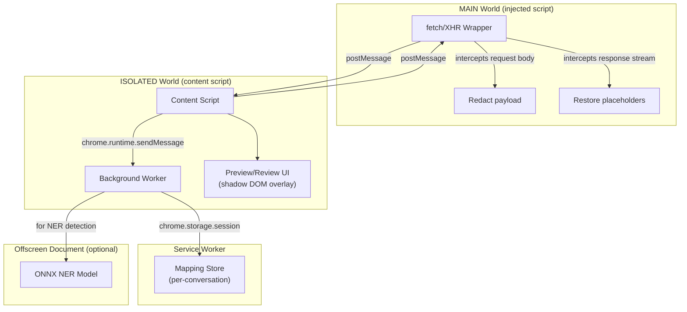

# 🏗️ Ratchet — Redesign Proposal (Step 2)

> **Goal:** Fix all 10 root causes from the diagnosis and make Ratchet a reliable, zero-dependency privacy shield that works on ChatGPT, Claude, and Gemini without requiring a Python backend.

---

## Option Evaluation

### Option A: Full TypeScript Extension (Recommended ✅)

Move all detection and redaction into the extension itself using TypeScript regex detectors + a small ONNX NER model running in an offscreen document.

| Pros | Cons |
|------|------|
| Zero external dependencies — nothing to install/start | Smaller NER model = lower accuracy for names/orgs |
| Works immediately on install | ONNX model adds ~5-15MB to extension size |
| No localhost network calls = no CORS/CSP issues | Cannot use spaCy — must port or use alternative |
| Survives service worker restarts (storage-backed) | Initial model load takes ~1-2s on first use |
| Simpler distribution (single CRX file) | |

### Option B: Keep Python as Optional Power Mode

Extension does basic regex detection natively; Python backend adds spaCy NER when running.

| Pros | Cons |
|------|------|
| Best of both worlds — works without Python, better with it | Two code paths to maintain |
| Existing backend code is reused | Users still need to install/run Python for full features |
| Gradual migration path | Must handle "backend unavailable" gracefully |

### Option C: Network-Layer Interception (MAIN World)

Instead of editing DOM inputs, inject a MAIN-world script that wraps `fetch`/`XMLHttpRequest` to rewrite request bodies and un-redact response streams.

| Pros | Cons |
|------|------|
| **100% reliable** — catches the actual API call regardless of editor type | Requires MAIN world script (no `chrome.*` APIs) |
| Works with any input method (voice, paste, drag-drop) | Must reverse-engineer each site's API payload format |
| No DOM manipulation fragility | Potential ToS concerns (modifying API requests) |
| Handles streaming responses natively | Site API changes require detector updates |

---

## Recommended Architecture: A + C Hybrid

Combine **Option A** (TypeScript-native detection) with **Option C** (network-layer interception) and **Option B** (Python as optional power mode).



### How it works:

1. **MAIN-world script** wraps `fetch`/`XHR` on the page
2. When the user submits a prompt, the wrapper intercepts the outgoing request body
3. The body is sent via `postMessage` to the ISOLATED content script
4. Content script sends it to the service worker for detection + redaction
5. Service worker runs regex detectors (fast path) + optionally ONNX NER (via offscreen document)
6. Redacted text + mapping are returned
7. Content script sends redacted body back to MAIN world via `postMessage`
8. MAIN-world script completes the `fetch` with the redacted body
9. When the response streams back, MAIN-world script intercepts tokens and sends them through the same channel for restoration
10. Restored tokens are passed back to the original response handler

### Why this is better:

| Root Cause | How this fixes it |
|-----------|-------------------|
| #1 (broken popup paths) | Fix Vite config `base: './'` |
| #2 (Python dependency) | TypeScript-native detectors, Python optional |
| #3 (DOM manipulation fails) | Network-layer interception — never touch the DOM input |
| #4 (wrong world) | MAIN-world script for fetch wrapping, ISOLATED for chrome APIs |
| #5 (MutationObserver loop) | Response restoration in the fetch response stream, not DOM |
| #6 (mapping lost) | `chrome.storage.session` — survives worker restart |
| #7 (selectAll bug) | No DOM editing needed |
| #8 (selector fragility) | No selectors needed for interception |
| #9 (markdown mangling) | New placeholder format (see below) |
| #10 (React chunk bloat) | Remove React from content script; use only in popup/options |

---

## Key Design Decisions

### 1. Placeholder Format

**Current:** `[PERSON_1]` — broken because:
- Markdown interprets `[text]` as a link reference
- Tokenizers may split on brackets
- Common in code/documentation

**Proposed:** `«PERSON_1»` (guillemets — Unicode U+00AB / U+00BB)

| Property | `[TYPE_N]` | `«TYPE_N»` | `__TYPE_N__` |
|----------|-----------|-----------|-------------|
| Survives markdown | ❌ | ✅ | ✅ |
| Unlikely in natural text | ❌ | ✅ | 🟡 |
| Survives tokenization | 🟡 | ✅ | ✅ |
| AI treats as opaque token | 🟡 | ✅ | ✅ |
| Human-readable | ✅ | ✅ | 🟡 |
| Copy-paste safe | ✅ | ✅ | ✅ |

I also considered `⟨TYPE_N⟩` (angle brackets U+27E8/U+27E9), but guillemets have better font support and are more recognizable. The regex for detection would be: `/«([A-Z_]+_\d+)»/g`

### 2. Mapping Storage

**Storage:** `chrome.storage.session` (MV3 API)
- Survives service worker restarts ✅
- Cleared when browser closes ✅ (good for privacy)
- 10MB quota (sufficient for thousands of mappings)
- No encryption needed — session storage is per-extension and in-memory only

**Keying:** Per-conversation, using the URL path as conversation ID:
- ChatGPT: `chatgpt.com/c/{conversation_id}`
- Claude: `claude.ai/chat/{conversation_id}`
- Gemini: `gemini.google.com/app/{conversation_id}`

If the URL doesn't contain a conversation ID (new chat), generate a UUID and associate it when the URL changes.

**Schema:**
```typescript
interface MappingEntry {
  placeholder: string;    // «PERSON_1»
  original: string;       // "John Doe"
  type: string;           // "PERSON"
  timestamp: number;      // when detected
}

interface ConversationMap {
  conversationId: string;
  siteOrigin: string;
  mappings: MappingEntry[];
  createdAt: number;
  lastUsedAt: number;
}

// Stored as: chrome.storage.session.set({ [`conv:${conversationId}`]: ConversationMap })
```

### 3. Detection Pipeline (TypeScript-native)

**Tier 1 — Regex Detectors (< 5ms):**
Port the existing Python regex patterns to TypeScript:
- Email, phone, SSN, credit card (with Luhn), IP addresses, API keys, URLs with credentials, dates of birth

**Tier 2 — ONNX NER Model (< 100ms):**
- Use `onnxruntime-web` (WASM backend) in an offscreen document
- Model: [Xenova/bert-base-NER](https://huggingface.co/Xenova/bert-base-NER) quantized (~30MB → 8MB int8)
- Detects: PERSON, ORG, LOC, MISC
- Loaded lazily on first use, cached in memory

**Tier 3 — Custom Rules (< 1ms):**
User-defined keyword/regex rules stored in `chrome.storage.local`

### 4. Review/Preview UI

- **Shadow DOM overlay** injected by the content script (isolated from site CSS)
- Shows a floating panel before the request is sent:
  - Highlighted entities with color coding by type
  - Toggle per-entity to include/exclude from redaction
  - "Send Redacted" / "Send Original" buttons
- Panel dismisses after send
- Minimal footprint — no React in the content script (vanilla JS + shadow DOM)

### 5. Network-Layer Interception Details

The MAIN-world script needs to handle each site's specific API:

| Site | API Endpoint | Payload Field | Response Format |
|------|-------------|---------------|-----------------|
| ChatGPT | `POST /backend-api/conversation` | `messages[].content.parts[]` | SSE (`text/event-stream`) |
| Claude | `POST /api/organizations/.../chat_conversations/.../completion` | `prompt` | SSE |
| Gemini | `POST /_/BardChatUi/data/assistant.lamda.BardFrontendService/StreamGenerate` | Protobuf-like | Streaming JSON |

Each site adapter extracts the prompt text, sends it for redaction, and rewrites the payload. On response, it intercepts the stream, buffers tokens until complete placeholders are assembled, restores them, and passes the restored text to the original callback.

**ToS/Safety consideration:** This approach modifies the request payload, which some sites may consider a ToS violation. However:
- We are redacting data *for privacy* — we are not adding, impersonating, or bypassing rate limits
- The modification is local and user-initiated
- No data is exfiltrated
- The user explicitly installed the extension for this purpose

I consider this acceptable and equivalent to a password manager auto-filling forms.

---

## Implementation Plan

### Phase 1: Foundation (fix build, remove Python dependency)
1. Fix Vite config (`base: './'`, proper HTML paths)
2. Port regex detectors to TypeScript
3. Implement `chrome.storage.session` mapping store
4. Create service worker message handler (no Python calls)
5. Basic popup that works

### Phase 2: Network Interception
6. Create MAIN-world injected script with fetch/XHR wrapper
7. Implement ChatGPT site adapter (most popular)
8. Implement postMessage bridge (MAIN ↔ ISOLATED ↔ service worker)
9. Request interception: detect prompt, redact, rewrite payload
10. Response interception: detect placeholders in stream, restore

### Phase 3: NER + Review UI
11. Add offscreen document with ONNX runtime
12. Load quantized NER model
13. Integrate NER into detection pipeline
14. Build shadow DOM review/preview overlay
15. Per-entity toggle UI

### Phase 4: Multi-site + Polish
16. Claude site adapter
17. Gemini site adapter
18. Per-conversation mapping with URL-based keying
19. Options page for custom rules (stored in extension, no backend)
20. Deprecate Python backend to "optional advanced mode"

### Phase 5: Testing
21. Unit tests for all regex detectors
22. Unit tests for redactor/restorer
23. Playwright test with mock chat page (local)
24. Performance benchmarks (< 100ms detection, < 50MB memory)

---

## What happens to the Python backend?

> [!IMPORTANT]
> The Python backend (`backend/` directory) is **not deleted**. It is explicitly deprecated to "optional power mode":
> - Add a `DEPRECATED.md` notice
> - The extension works fully without it
> - If the user starts the Python server AND enables "Power Mode" in options, the extension routes detection through the Python backend for enhanced NER accuracy (spaCy's `en_core_web_trf` model is more accurate than the quantized ONNX model)
> - The extension must gracefully handle the backend being unavailable

---

> [!NOTE]
> **Awaiting your approval before proceeding to Step 3 (implementation).**
> 
> Key decisions I'd like your input on:
> 1. **Placeholder format:** `«TYPE_N»` (guillemets) — OK?
> 2. **ONNX NER model size:** ~8MB quantized acceptable for extension?
> 3. **Network interception approach:** OK with wrapping fetch/XHR?
> 4. **Review UI before send:** Required for v1 or can be deferred?
> 5. **Which site to prioritize first?** I suggest ChatGPT.
